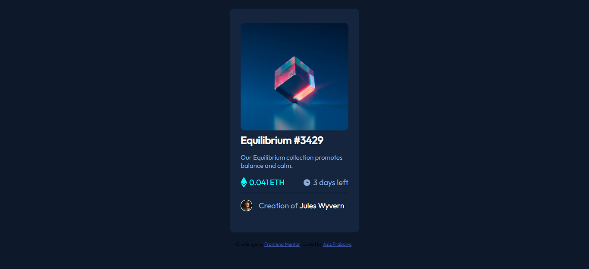

# Frontend Mentor - NFT preview card component solution

This is a solution to the [NFT preview card component challenge on Frontend Mentor](https://www.frontendmentor.io/challenges/nft-preview-card-component-SbdUL_w0U). Frontend Mentor challenges help you improve your coding skills by building realistic projects.


## Table of contents

- [Overview](#overview)
  - [The challenge](#the-challenge)
  - [Screenshot](#screenshot)
  - [Links](#links)
- [My process](#my-process)
  - [Built with](#built-with)
  - [What I learned](#what-i-learned)
- [Author](#author)

## Overview

### The challenge

Users should be able to:

- View the optimal layout depending on their device's screen size
- See hover states for interactive elements

### Screenshot



### Links

- Solution URL: [SOLUTION](https://www.frontendmentor.io/solutions/nft-preview-card-component-using-css-flexbox-jB4KA_ETpV)
- Live Site URL: [LIVE SITE](https://azizp128.github.io/NFT-preview-card-component/)

## My process

### Built with

- Semantic HTML5 markup
- Flexbox
- Mobile-first workflow

### What I learned

I learned about the importance of structuring the HTML code first before moving to styling using CSS and how to make a divider in this challenge :).

To see how you can add code snippets, see below:

```html
<div>
  <div class="balance">
    
    <p class="balance">0.041 ETH</p>
  </div>
  <div class="timeline">
    
    <p>3 days left</p>
  </div>
</div>
<hr class="solid" />
```

```css
hr.solid {
  border: 0;
  border-top: 1px solid white;
  opacity: 0.3;
  margin-top: -5px;
}
```

## Author

- Frontend Mentor - [@azizp128](https://www.frontendmentor.io/profile/azizp128)
- Twitter - [@azizprbw](https://www.twitter.com/azizprbw)
